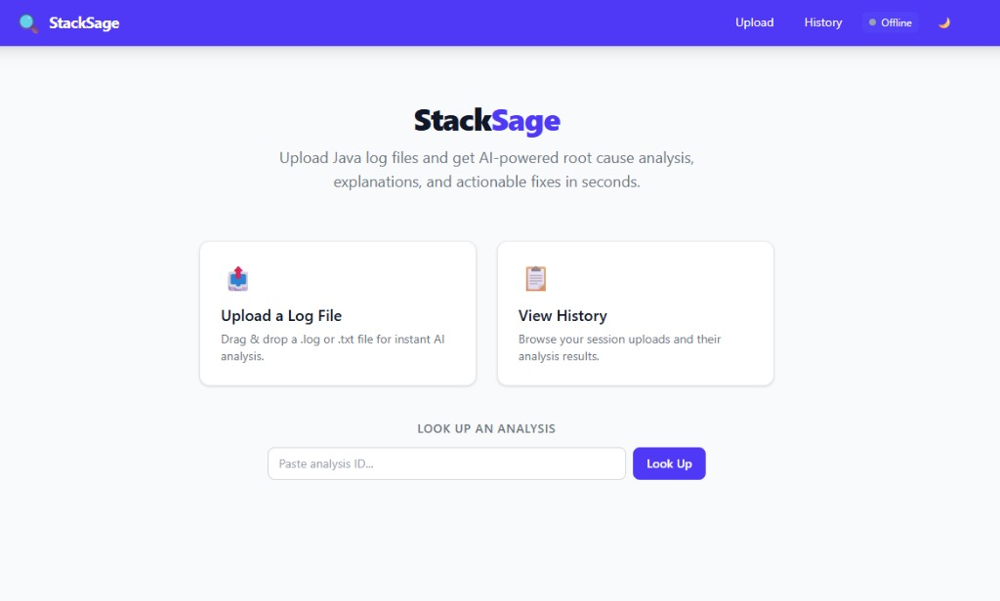

# StackSage

AI-powered Java debugging platform. Upload Java log files or submit pre-parsed exception data, and get automated root cause analysis, explanations, and actionable fixes powered by AI (via OpenRouter).



## Project Structure

```
stacksage/
├── stacksage-common/    # Shared parser library (no Spring dependency)
│   └── parser/          # ExceptionDetail, LogParser, RegexLogParser
├── stacksage-server/    # Spring Boot REST API server (port 9090)
│   ├── config/          # Async, AI provider, rate limiting, storage, Swagger
│   ├── controller/      # Upload + Analysis + SSE REST endpoints
│   ├── service/         # File upload, log analysis, AI diagnosis, orchestration
│   ├── model/           # JPA entities, DTOs, enums
│   └── repository/      # Spring Data JPA repositories
├── stacksage-ui/        # Preact + Vite + Tailwind frontend (port 8080)
│   └── src/             # Pages, components, hooks, API client
└── stacksage-cli/       # Standalone CLI tool (fat JAR)
    └── cli/             # StackSageCli main class
```

## Prerequisites

- **Java 17** (JDK)
- **Node.js 24** (LTS) — for the UI
- **PostgreSQL** (or a hosted instance like [Neon](https://neon.tech))
- **Maven** (wrapper included: `mvnw` / `mvnw.cmd`)
- **AI API key** (OpenRouter or OpenAI-compatible provider, for AI-powered diagnosis)

## Build

```bash
# Using the build script (sets JAVA_HOME automatically)
./build.ps1 package

# Or using Maven directly
./mvnw clean package
```

This builds all three modules:
- `stacksage-common-0.1.0-SNAPSHOT.jar` — parser library
- `stacksage-server-0.1.0-SNAPSHOT.jar` — Spring Boot executable JAR
- `stacksage-cli-0.1.0-SNAPSHOT.jar` — standalone fat JAR

## Run

### API Server

```bash
# Set required environment variables
export AI_API_KEY=sk-your-key-here
export DB_USERNAME=your_db_user       # optional, defaults to neondb_owner
export DB_PASSWORD=your_db_password   # optional, defaults to configured value

# Run the server
java -jar stacksage-server/target/stacksage-server-0.1.0-SNAPSHOT.jar
```

The API server starts on port `9090` by default.

### UI

```bash
cd stacksage-ui
npm install
npx vite
```

The UI starts on port `8080` and proxies API requests to the server at `localhost:9090`.

## API Documentation

Once the server is running, interactive API docs are available at:

- **Swagger UI:** `http://localhost:9090/swagger-ui.html`
- **OpenAPI JSON:** `http://localhost:9090/v3/api-docs`

## API Endpoints

### Uploads

| Method | Endpoint | Description |
|--------|----------|-------------|
| `POST` | `/api/v1/uploads` | Upload a `.log` or `.txt` file (multipart) |
| `GET` | `/api/v1/uploads/{id}` | Get upload metadata (add `?content=true` for file content) |
| `DELETE` | `/api/v1/uploads/{id}` | Delete an upload |

### Analysis

| Method | Endpoint | Description |
|--------|----------|-------------|
| `GET` | `/api/v1/uploads/{uploadId}/analysis` | Poll analysis results by upload ID |
| `POST` | `/api/v1/analyses` | Submit pre-parsed exceptions (used by CLI) |
| `GET` | `/api/v1/analyses/{analysisId}` | Get analysis results by analysis ID |

### Events

| Method | Endpoint | Description |
|--------|----------|-------------|
| `GET` | `/api/v1/events` | SSE stream for real-time notifications |

### Health

| Method | Endpoint | Description |
|--------|----------|-------------|
| `GET` | `/actuator/health` | Application health check |
| `GET` | `/actuator/info` | Application info |

## CLI Usage

The CLI parses log files locally and sends only structured exception data to the server — ideal for large files.

```bash
# Basic usage (submits to localhost:9090)
java -jar stacksage-cli-0.1.0-SNAPSHOT.jar app.log

# Specify server URL
java -jar stacksage-cli-0.1.0-SNAPSHOT.jar --server http://myserver:9090 app.log

# Wait for results and print them
java -jar stacksage-cli-0.1.0-SNAPSHOT.jar --wait app.log

# Full example
java -jar stacksage-cli-0.1.0-SNAPSHOT.jar --server http://prod:9090 --wait /var/log/app.log
```

### Server URL Resolution

The CLI resolves the server URL in this order:

1. `--server <url>` flag (highest priority)
2. `STACKSAGE_SERVER` environment variable
3. `http://localhost:9090` (default)

### Output

```
Parsing app.log (2 MB)...
Found 3 exception(s)
Submitting to StackSage server (http://<server>:9090)...

Analysis ID: a1b2c3d4-e5f6-7890-abcd-ef1234567890
View results: http://<server>:9090/api/v1/analyses/a1b2c3d4-e5f6-7890-abcd-ef1234567890
```

With `--wait`, the CLI polls until analysis completes and prints formatted results:

```
Waiting for analysis...... COMPLETED

[1/3] java.lang.NullPointerException — HIGH
  Root cause: Uninitialized userService field
  Explanation: The @Autowired annotation is missing...
  Fix: Add @Autowired to the userService field...
```

## Configuration

### Environment Variables

| Variable | Description | Default |
|----------|-------------|---------|
| `DB_USERNAME` | PostgreSQL username | `neondb_owner` |
| `DB_PASSWORD` | PostgreSQL password | (configured) |
| `AI_API_KEY` | AI provider API key (OpenRouter, OpenAI, etc.) | (none — required for AI features) |
| `STACKSAGE_SERVER` | CLI server URL | `http://localhost:9090` |

### Application Properties

Key settings in `application.yml`:

| Property | Description | Default |
|----------|-------------|---------|
| `app.upload-dir` | File storage directory | `./uploads` |
| `app.rate-limit.enabled` | Enable rate limiting | `true` |
| `app.rate-limit.max-requests` | Requests per window | `20` |
| `app.rate-limit.window-seconds` | Rate limit window | `60` |
| `app.ai.model` | AI model identifier | `meta-llama/llama-3.3-70b-instruct:free` |
| `app.ai.base-url` | AI provider base URL | `https://openrouter.ai/api` |
| `app.ai.max-tokens` | Max response tokens | `1024` |
| `app.ai.temperature` | AI temperature | `0.3` |

## Database

StackSage uses **PostgreSQL** with **Flyway** for schema migrations. Migrations are located in:

```
stacksage-server/src/main/resources/db/migration/
```

Flyway runs automatically on server startup and applies any pending migrations.

## Tech Stack

- **Java 17** + **Spring Boot 3.3**
- **Preact** + **Vite** + **Tailwind CSS** — lightweight UI (~18KB gzipped)
- **PostgreSQL** + **Flyway** migrations
- **OpenRouter API** (Llama 3.3 70B free tier) via Spring RestClient — also compatible with OpenAI and other providers
- **Server-Sent Events** for real-time analysis and cleanup notifications
- **Spring Boot Actuator** for health checks
- **SpringDoc OpenAPI** for interactive API documentation
- **Lombok** for reducing boilerplate
- **JUnit 5** + **AssertJ** for testing
